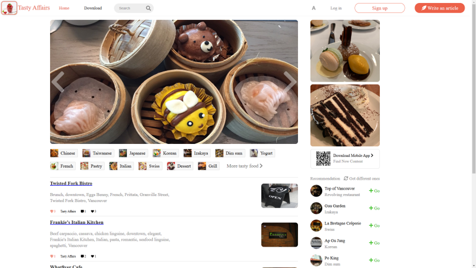
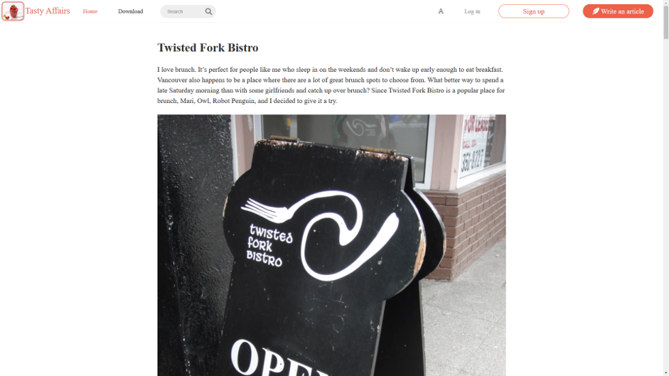
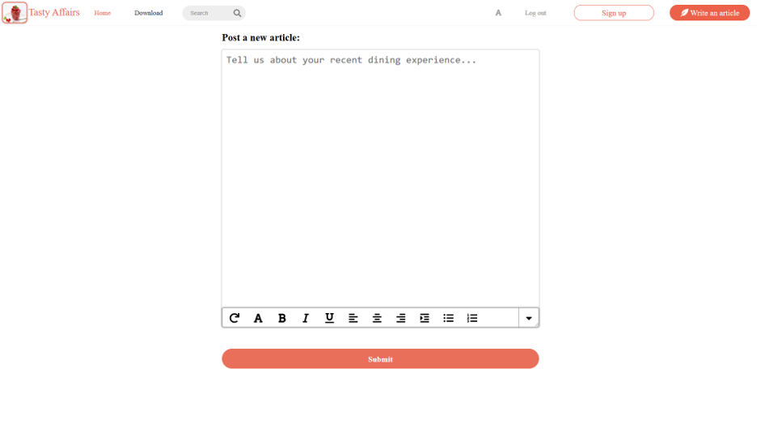
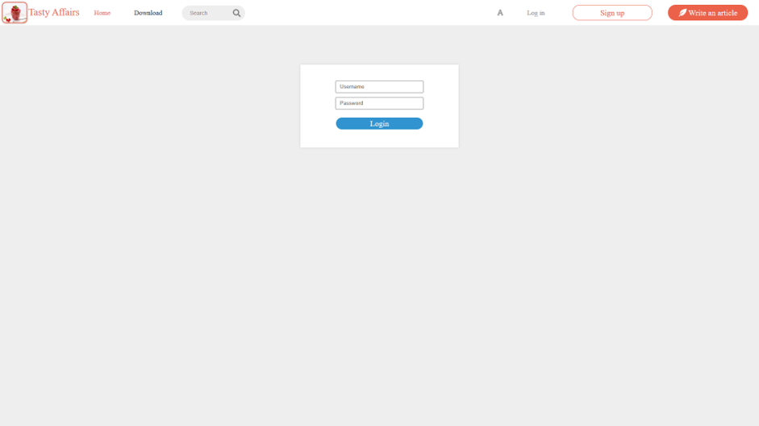

# A-Simple-Blog

An online blog system which includes registration/login, read/create/edit sections.

Used React Router to set the main page and its detail pages.

The blog single page, showing the reviews of a specific restaurant.

The new article page, cannot write a new article without logging in first

The login page

Encapsulated functional modules for reusability (abstract axios to provide a higher level abstraction of backend APIs).

Utilized React-Redux, Redux-Thunk and Restful API to manage the data flow back and forth separately.

Organized views and partial components into directories for scalability and maintainability

Technologies: Reactjs, Redux, Redux-Thunk, Immutablejs, React Router, Styled-components.
